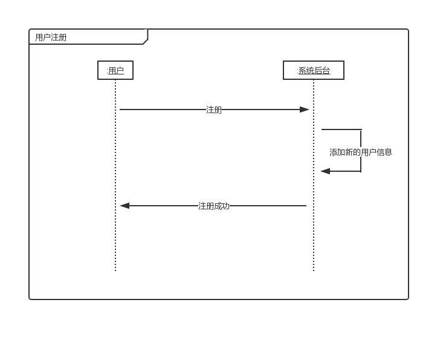
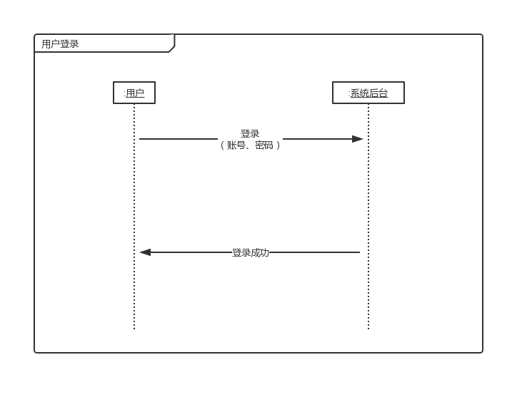
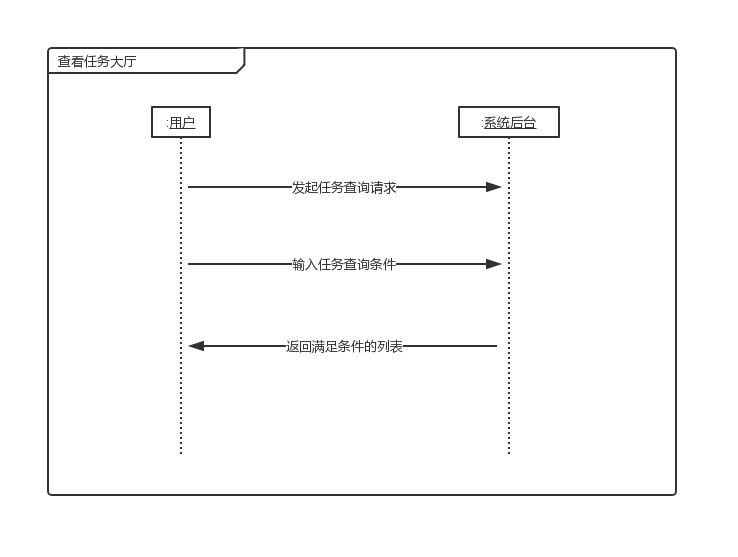
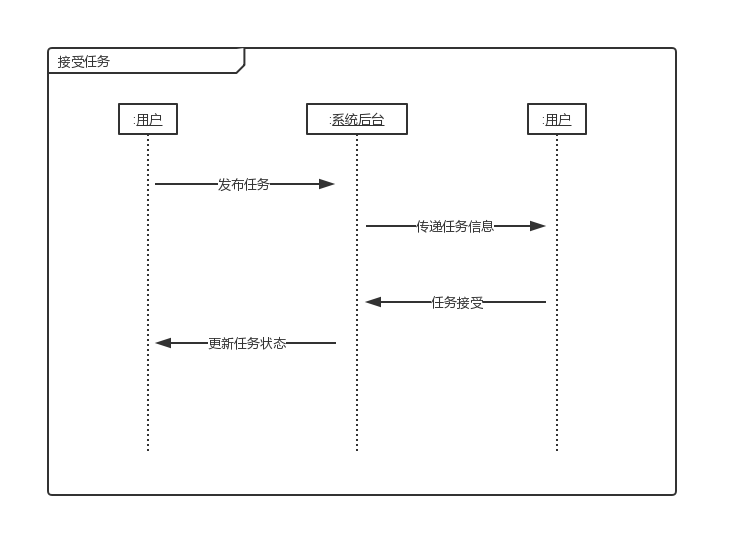
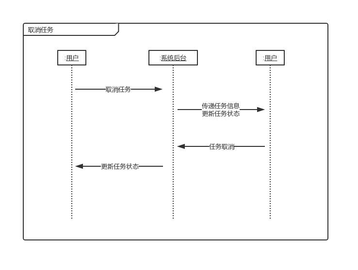

## 功能模型

- [功能模型](#%E5%8A%9F%E8%83%BD%E6%A8%A1%E5%9E%8B)
    - [用户注册](#%E7%94%A8%E6%88%B7%E6%B3%A8%E5%86%8C)
    - [用户登录](#%E7%94%A8%E6%88%B7%E7%99%BB%E5%BD%95)
    - [查看任务大厅](#%E6%9F%A5%E7%9C%8B%E4%BB%BB%E5%8A%A1%E5%A4%A7%E5%8E%85)
    - [查询历史任务](#%E6%9F%A5%E8%AF%A2%E5%8E%86%E5%8F%B2%E4%BB%BB%E5%8A%A1)
    - [接受任务](#%E6%8E%A5%E5%8F%97%E4%BB%BB%E5%8A%A1)
    - [取消任务](#%E5%8F%96%E6%B6%88%E4%BB%BB%E5%8A%A1)

#### 用户注册

#### 用户登录

#### 查看任务大厅

#### 查询历史任务

#### 接受任务

#### 取消任务

